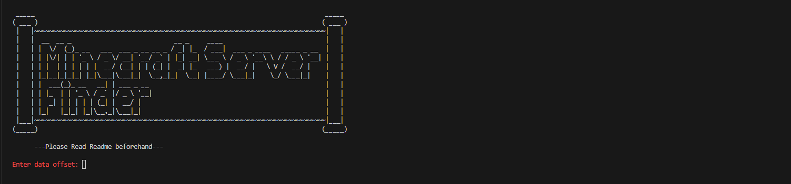
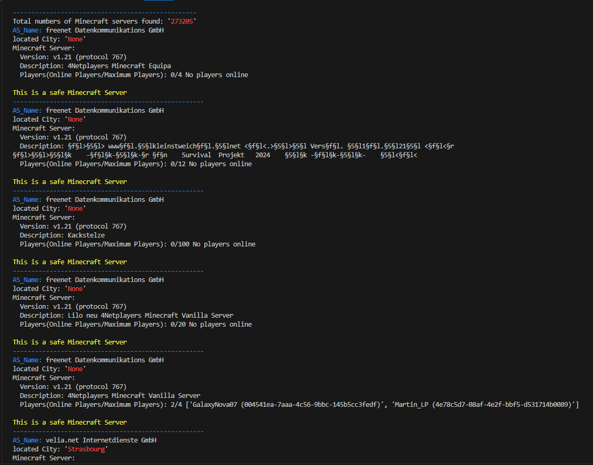

# Minecraft-Server-Finder

 
### - About -
 
This is a simple Python script that allows you to find Minecraft servers based on specific countries and/or cities using Criminal IP's banner search API. It also provides information about whether the server is safe.
 
### - Prerequisites -
 
- You need to have an API key from the [Criminal IP service](https://www.criminalip.io/).
- This script is written in Python 3.
- The script uses the `requests` module.
 
### - How to Run -
 
1. Run `minecraft_server_finder.py` in your terminal or on an IDE.
2. You will be asked for the number of data offset. The number should be a multiple of 10 (e.g., 10, 20, 30). The maximum number is 9000.
3. After entering the offset, you will be asked to provide the country code.
   - Country codes are two-letter alphabets known as ISO 3166-1 alpha-2 (e.g., US, JP, AU).
4. Next, you will be asked for the city name.
5. Finally, you will be prompted to enter your API key.
 
### - Screen -
 

 
### - Results -
 
- First, the total count of Minecraft servers will appear.
- Then, information for each server will be displayed, including the AS name, city name, Minecraft version, and a brief description.
- Ten servers are shown each time (hence the offset in multiples of 10).
 
### - Errors -
 
- If error code 500 pops up, it means you have entered an invalid argument for the offset (e.g., skipped entering a number or entered an alphabet).
